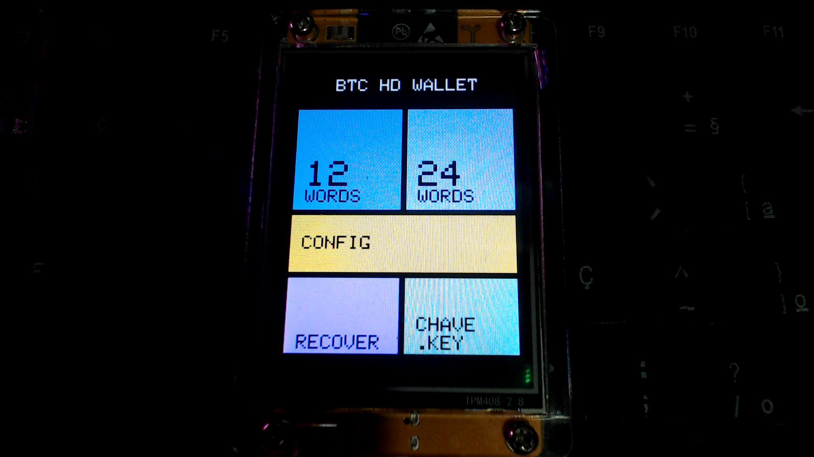

# 🔐 BTCWallet — Cold Wallet Bitcoin para ESP32 ESP32-2432S028R CYD-(Cheap Yellow Display)

Carteira Bitcoin offline (cold wallet) de código aberto construída sobre o **ESP32-2432S028R (Cheap Yellow Display)**. Gera e armazena carteiras HD BIP-39/BIP-32 com criptografia AES-256-GCM diretamente no dispositivo, sem conexão com a internet.


## 📋 Índice

- Geração de seed BIP-39 (12/24 palavras) com entropia do hardware
- Recover de seed BIP-39 (12/24 palavras) — digitar só as 4 primeiras letras
- Derivação de endereços HD (BIP-44 · BIP-49 · BIP-84)
- Exibição de endereços via QR Code na tela TFT
- Armazenamento criptografado no cartão SD (AES-256-GCM + PBKDF2-SHA256)
- Interface touch em modo Portrait 240×320
- Sem Wi-Fi, sem Bluetooth — air-gapped por design
- Aplicativo desktop em Rust para descriptografar o backup `.enc`
- 
- - Você tem o **ESP32-2432S028R (CYD)**
- 
---

## Hardware Necessário

| Componente | Especificação |
|------------|---------------|
| ESP32-2432S028R (CYD) |
| Display | TFT 2.8" 240×320 (ILI9341) |
| Armazenamento | Cartão microSD Formatado (FAT32) |

### Pinagem Touch (VSPI)

| Sinal | Pino ESP32 |
|-------|-----------|
| CLK   | GPIO 25   |
| MOSI  | GPIO 32   |
| MISO  | GPIO 39   |
| CS    | GPIO 33   |
| IRQ   | GPIO 36   |

---

## Dependências

### Firmware (PlatformIO)

- [TFT_eSPI](https://github.com/Bodmer/TFT_eSPI)
- [XPT2046_Touchscreen](https://github.com/PaulStoffregen/XPT2046_Touchscreen)
- [uBitcoin](https://github.com/micro-bitcoin/uBitcoin)
- [QRCode](https://github.com/ricmoo/QRCode)

---

## Estrutura do Projeto

```
BTCWallet/
├── src/
│   └── main.cpp                # Firmware principal (ESP32)
│
├── include/
│   ├── BTCWallet_SD.h          # Criptografia e acesso ao SD
│   ├── BTCWallet_QRCode.h      # Geração de QR Code
│   ├── BTCWallet_Display.h     # Interface TFT
│   ├── BTCWallet_BIP39.h       # Geração de seed BIP-39
│   ├── User_Setup.h
│   └── splash_image.h
│
├── lib/
│   ├── QRCode/
│   ├── TFT_eSPI/
│   ├── uBitcoin/
│   └── XPT2046_Touchscreen/
│
├── decrypt/
│   ├── src/
│   │   └── main.rs             # App desktop (Rust/egui)
│   ├── Cargo.toml
│   └── Cargo.lock
│
├── images/                     # Capturas de tela e fotos do hardware
│   ├── hardware.jpg
│   ├── tela_menu.png
│   └── tela_qrcode.png
│
├── platformio.ini
└── README.md
```

---

## Como Compilar e Gravar

### 1. Pré-requisitos

```bash
#gitclone
gitclone https://github.com/Hash-Crypto-6568e1158933296b86/BTCWallet.git

# Entrar na pasta do projeto
cd ~/BTCWallet

# Instalar Python 3 e criar ambiente virtual
python3 -m venv .venv

# Ativar o ambiente — fish shell
source .venv/bin/activate.fish

# Instalar dependências Python
pip3 install platformio intelhex
```

### 2. Compilar o firmware

```bash
# Limpar artefatos anteriores (opcional)
pio run --target clean

# Compilar
pio run
```

### 3. Gravar no ESP32

```bash
# Upload padrão — detecta e envia os arquivos automaticamente
pio run --target upload

# Em caso de erro:

# Compilar, gravar e abrir monitor serial
pio run --target upload && pio device monitor

# Especificar porta manualmente (se houver mais de uma)
pio run --target upload --upload-port /dev/ttyUSB0
```

> **Linux:** caso ocorra erro de permissão na porta serial, adicione seu usuário ao grupo `dialout` e reinicie a sessão:
> ```bash
> sudo usermod -aG dialout $USER
> ```

---

## Mapa de Memória Flash

| Offset    | Conteúdo              |
|-----------|-----------------------|
| `0x1000`  | bootloader.bin        |
| `0x8000`  | partitions.bin        |
| `0x10000` | BTCWallet.bin         |

---

## Programa para Descriptografar os Arquivos no Cartão SD Desktop (Rust)

O aplicativo `decrypt/` permite recuperar o backup da carteira gerado pelo dispositivo em qualquer computador offline.

### Instalando o Rust

Caso ainda não tenha o Rust instalado na sua máquina:

**Linux / macOS**
```bash
curl --proto '=https' --tlsv1.2 -sSf https://sh.rustup.rs | sh

# Após a instalação, recarregue o PATH da sessão atual
source "$HOME/.cargo/env"

# Verifique a instalação
rustc --version
cargo --version
```

**Windows**

1. Baixe e execute o instalador oficial: [https://rustup.rs](https://rustup.rs)
2. Siga as instruções na tela (instale as ferramentas de build do Visual Studio quando solicitado)
3. Abra um novo terminal e verifique:
```powershell
rustc --version
cargo --version
```

> Para atualizar o Rust no futuro:
> ```bash
> rustup update
> ```

### Compilar o descriptografador

```bash
cd decrypt
cargo build --release
```

O binário compilado estará em:

```
decrypt/target/release/btc_decrypt_gui        # Linux / macOS
decrypt\target\release\btc_decrypt_gui.exe    # Windows
```

### Como usar

1. Abra o aplicativo **BTC Wallet Decryptor**
2. Selecione o arquivo **`.enc`** gerado pelo dispositivo no SD card
3. Selecione o arquivo **`chave.key`** gerado junto com o `.enc`
4. Digite a **senha** usada no momento da criação da carteira
5. Clique em **🔓 Descriptografar**

### Formato do arquivo cifrado (`.enc`)

```
[ SALT 16 bytes ][ IV 12 bytes ][ TAG 16 bytes ][ Ciphertext N bytes ]
```

A chave AES-256 é derivada com **PBKDF2-HMAC-SHA256** (100.000 iterações) a partir da senha e do salt. O salt é armazenado tanto no arquivo `.enc` quanto no `chave.key` para verificação de consistência antes da descriptografia.

---

## Segurança

- **Air-gapped:** Wi-Fi e Bluetooth permanecem desativados durante toda a operação.
- **Criptografia:** AES-256-GCM garante confidencialidade e autenticidade do backup.
- **Derivação de chave:** PBKDF2-HMAC-SHA256 com 100.000 iterações protege contra ataques de força bruta.
- **Verificação de integridade:** O salt no `.enc` é comparado ao `chave.key` antes de qualquer operação criptográfica.
- **Senha nunca gravada:** A senha é mantida apenas em memória RAM e nunca persiste em disco.

> ⚠️ **Guarde o arquivo `chave.key` e a senha em locais separados e seguros.** A perda de qualquer um deles torna o backup irrecuperável.

---

## Licença

Distribuído sob a licença MIT. Consulte o arquivo `LICENSE` para mais detalhes.
